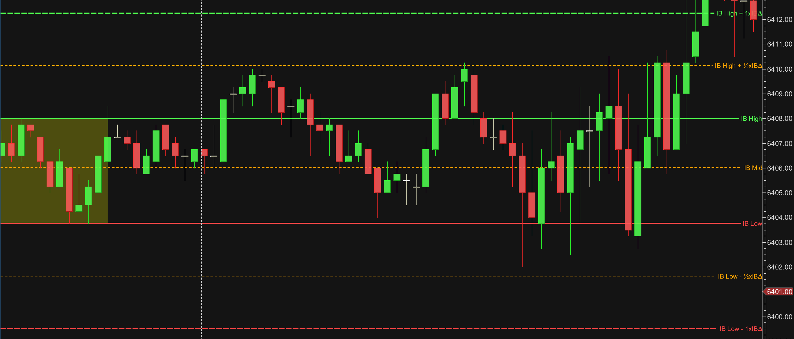
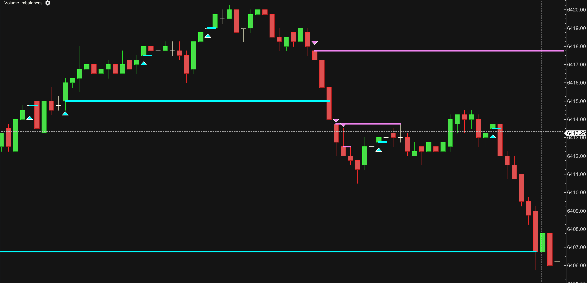
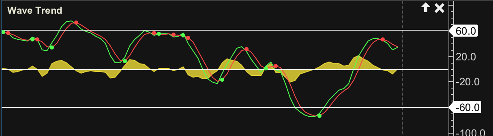

# MotiveWave

This is my collection of studies and strategies for MotiveWave 6.

### Initial Balance

An Initial Balance study in the style of Trader Drysdale's version for TradingView,
and as used in his VWAP Wave trading system.

* Original: https://www.tradingview.com/script/YT6IrC8d-Initial-Balance-Wave-Map/
* YouTube: https://www.youtube.com/@traderdrysdale
* Website: https://traderdrysdale.com/

### Volume Imbalances

Highlights volume imbalances, by looking for a gap between a candle's close and the following candle's open.
Imbalances are highlighted until they are filled by a later candle.
Often used by Trader Oracle.

### Wave Trend

LazyBear's wave trend oscillator.

* Original: https://www.tradingview.com/script/2KE8wTuF-Indicator-WaveTrend-Oscillator-WT/

Known Issues:

* Ideally it would also support fills on the fast/slow waves, 
however MotiveWave does not appear to support explicit Z-ordering of fills,
so there is no way to control which fill appears on top of the others.
Until this is resolved it only supports a single fill on the wave delta.

## Installation

* Download the latest gambcl-motivewave-N.N.N.zip file from here https://github.com/gambcl/MotiveWave/releases
* Unzip the zip file
* Copy the gambcl-motivewave.jar file into your "MotiveWave Extensions" folder
* Restart MotiveWave
* These studies can be found under the "Study > Custom" menu
